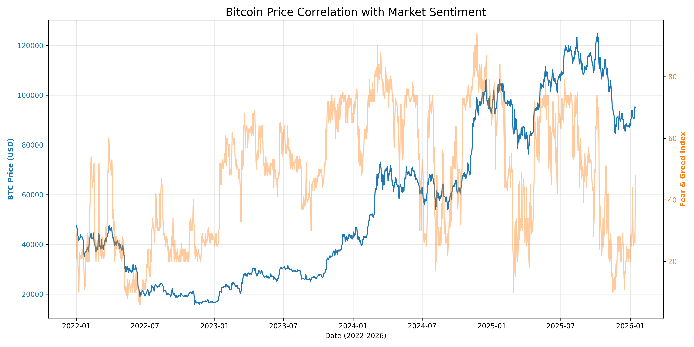

# crypto-sentiment-analysis
# Bitcoin Price vs Market Sentiment Analysis

## Overview
This project explores the relationship between Bitcoin (BTC) price volatility and market psychology using the **Crypto Fear & Greed Index**. It demonstrates a full data pipeline: from API acquisition to SQL storage and visual analysis.

## Project Structure
* `data_acquisition.py`: Fetches BTC price data via `yfinance` and sentiment scores via API.
* `create_database.py`: Stores and joins data in a relational **SQLite** database.
* `analysis_plots.py`: Performs correlation analysis and generates visual insights.
* `crypto_analysis.db`: The final SQL database containing processed records.

## Key Visual Insight
The chart below shows how extreme market emotions often precede price shifts:

## Tech Stack
* **Python** (Pandas, Matplotlib, Seaborn)
* **SQL** (SQLite)
* **Financial APIs**
